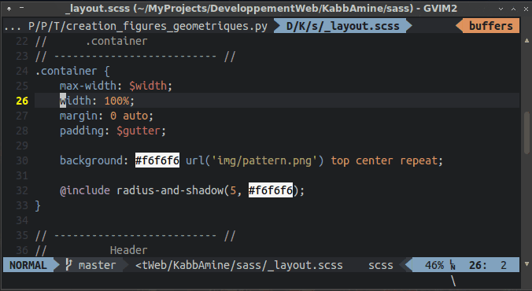

Zeavim - Zeal for Vim
=====================

Description
-------------

Zeavim allows to use [Zeal](http://zealdocs.org) documentation browser directly from [Vim](http://vim.org).

This plugin was tested in GNU/Linux and Windows.

Installation
-------------

To use zeavim, you need of course to have Zeal installed. Grab it from [here](http://zealdocs.org/download.html) and install it .

### Manual installation

Install the distributed files into Vim runtime directory which is usually `~/.vim/`, or `$HOME/vimfiles` on Windows.

### Using Pathogen
If you're using pathogen, extract the file into `bundle` directory.

### Using Vundle
Just add the following line in the Vundle part of your vimrc

	Plugin 'KabbAmine/zeavim.vim'

Then proceed to the installation of the plugin with the following command:

	:PluginInstall

Usage
-----

They are 3 ways of using zeavim:

1.	`<leader>z` - To execute Zeal with the current word (Or visual selection in VISUAL mode) as a query and the file type (Sometimes file extension or a manually specified docset) as a docset.
3.	`<leader>Z` (Note the capital *z*) - To use the file type (Sometimes file extension or a manually specified docset) as a docset and specify the query manually.

	

4.	`<leader><leader>z` - To specify manually both query and docset.

	

Mapping
-------

You can easily change the mapping keys of zeavim:

	nmap NEW_MAPPING <Plug>Zeavim				" <leader>z (NORMAL mode)
    vmap NEW_MAPPING <Plug>ZVVisSelection		" <leader>z (VISUAL mode)
    nmap NEW_MAPPING <Plug>ZVKeyword			" <leader>Z
    nmap NEW_MAPPING <Plug>ZVKeyDocset			" <leader><leader>z

Or you can in a global way change the leader key in Vim (`/` by default) by putting in your vimrc:

	let mapleader="NEW_LEADER_KEY"

Commands
-------

### Main commands

For those of you who prefer using commands, here they are:

	Zeavim		" Normal
	ZvV			" VISUAL mode
	ZvK			" Type quey
	ZvKD		" Type docset and quey

### Specify manually a docset

If you need a lazy way to specify a docset, you can use:

	Docset DOCSET_NAME

As an example, I'm working on a `scss` file but I want to get `compass` documentation when using Zeavim, so I just need to specify manually this docset:

	Docset compass

Then Zeavim **only for the current buffer** will use `compass` as a docset.

To revert that and get zeavim working like usually, a simple `Docset` without argument is enough.

Customization
-------------

### Location of Zeal

By default zeavim assume that *zeal* is located in `%ProgramFiles/Zeal/zeal.exe` for Windows and `/usr/bin/zeal` for UNIX systems.
You can specify Zeal's location manually by adding in your vimrc:

	if has('win32') || has('win64')
		let g:zv_zeal_directory = " path\\to\\zeal.exe\""
	else
		let g:zv_zeal_directory = "/usr/bin/zeal"
	endif

### Adding file types

Zeavim generates the zeal docset name from the extension (Or the filetype vim option) of the current file, but if you need to add some other file types, you can create in your vimrc a dictionnary with the extension or the vim file type as the key and the value as the docset name:

	let g:zv_added_files_type = {
				\ 'EXTENSION': 'DOCSET_NAME',
                \ 'FILE_TYPE': 'DOCSET_NAME',
				\ }

As an example (Those file types are already included into zeavim):

	let g:zv_added_files_type = {
				\ 'cpp': 'C++',
				\ 'js': 'Javascript',
				\ 'md': 'Markdown',
				\ 'mdown': 'Markdown',
				\ 'mkd': 'Markdown',
				\ 'scss': 'Sass',
				\ }

### Disable default mappings

You can disable the default mappings by adding to your vimrc:

    let g:zv_disable_mapping = 1

Notes
-----

Zeavim is my first vim plugin and it was created in the beginning for a personal use, so please feel free to report bug(s) and contact me if you want, I usually answer in 1-2 days.

Thank to [Jerzy Kozera](https://github.com/jkozera) for creating such wonderful open-source application.

Thank to Bram Moolenaar for creating the best piece of software in the world :D

Thank to you if you're using zeavim.
